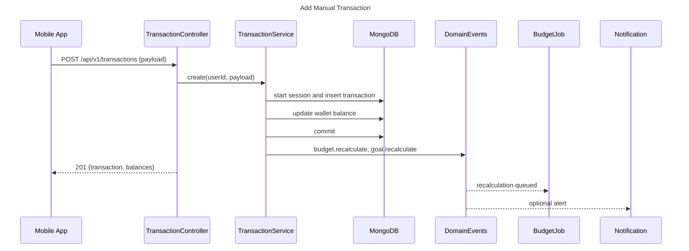
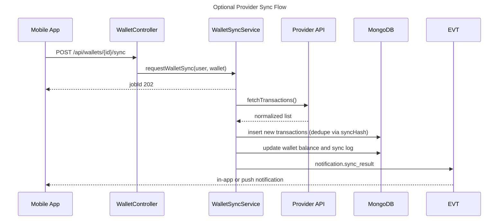
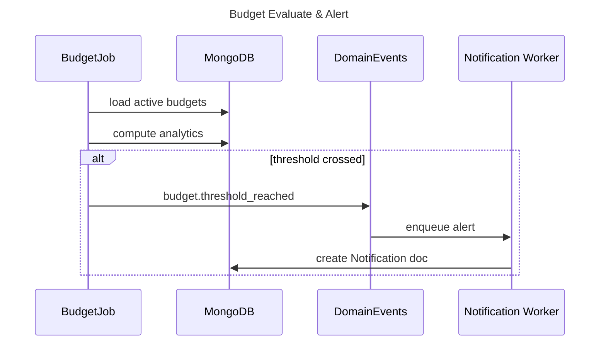
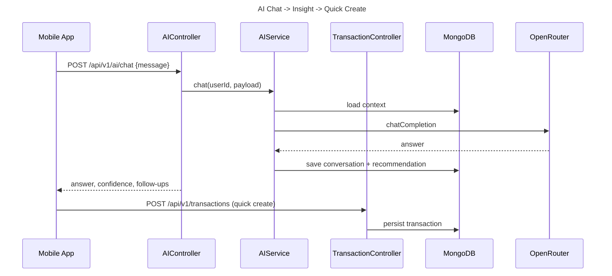
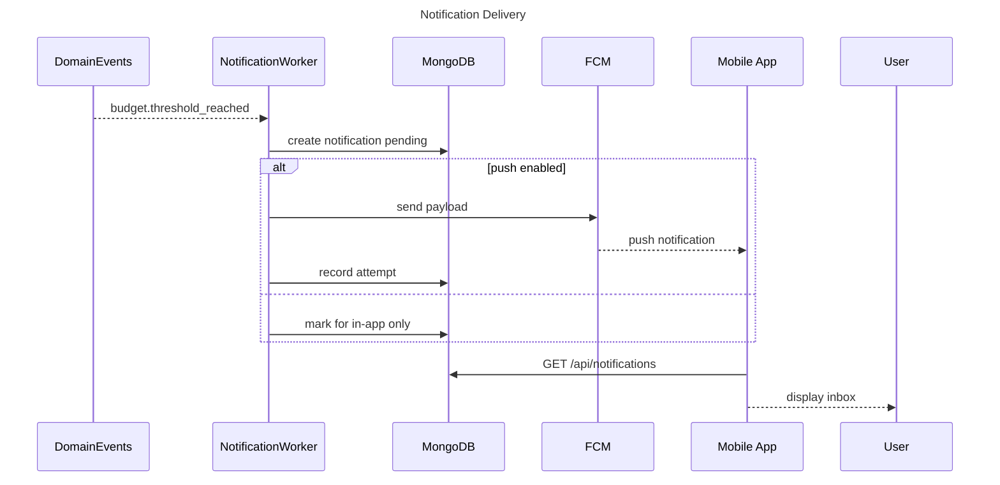

# Mobile <-> Backend Flow Spec — Personal Finance AI

## 0) Conventions

- Base URL: `https://api.myfinance.vn`, versioned under `/api/v1` for new endpoints; legacy `/api` routes supported but mobile should default to `/api/v1`.
- Auth: `Authorization: Bearer <accessToken>` on every protected call. Refresh tokens stored securely and exchanged via `POST /api/auth/refresh-token`.
- Error envelope:
  ```json
  {
    "success": false,
    "message": "Localized human-readable message",
    "code": "DOMAIN_CODE",
    "details": {
      "field": "validation message"
    }
  }
  ```
  If code missing, treat as "UNKNOWN_ERROR".
- Pagination: `?page=<int>&limit=<int>` (default 1 & 20). Responses include `page`, `limit`, `total`. Sorting via `?sort=-createdAt` where supported. Filters per resource (wallet, category, startDate, endDate).
- i18n: backend responses default to Vietnamese; UI should map server messages to translation keys (for example `notifications.budget_exceeded`). Currency default VND; multi-currency allowed per wallet. Conversion happens client-side for display until backend provides FX service (reference rate: Vietcombank daily table).
- Feature flags (fetch via config endpoint or remote config):
  - `bankingOptional`: OFF (default) hides provider linking UI; ON enables.
  - `aiEnabled`: toggles AI chat and auto-categorization surfaces.
  - `pushEnabled`: controls FCM flows and in-app inbox behaviour.

## 1) Navigation Map (Mobile)

- React Navigation structure:
  - `AuthStack`: Register, Login, VerifyEmail, ResetPassword.
  - `MainTabs`: Home, Wallets, Transactions, Budgets, AI, Settings.
  - Each tab hosts stack:
    - `HomeStack`: Dashboard, InsightsDetail.
    - `WalletsStack`: WalletList, WalletDetail, WalletForm.
    - `TransactionsStack`: TransactionsFeed, TransactionFilters, TransactionDetail, AddManualTxn.
    - `BudgetsStack`: BudgetsList, BudgetDetail, BudgetForm.
    - `AIStack`: AIChat, AITransactionDraft, RecommendationDetail.
    - `SettingsStack`: Profile, Security, ExportData, Subscription, NotificationsCenter.
  - Modals: AddTxnModal, LinkProviderModal (visible only if `bankingOptional=ON`), ContributionModal, CheckoutWebView.
  - `AdminStack` gated by `role=admin`: AdminDashboard, PlanEditor, SyncLogs.
- Deep links:
  - `myfinance://payments/return?status=success&requestId=...`
  - `myfinance://notifications/:id`
  - `myfinance://ai/chat?conversationId=...`
  - `myfinance://goals/:goalId/contribute`
- Permissions: request push notifications on first dashboard visit if `pushEnabled`. Optional biometric or passcode gate for sensitive Settings sections.

## 2) Screen-by-Screen Mapping

### 2.1 Auth (Register, Login, Verify, ResetPwd)

- JTBD: create account, log in, verify email, recover password.
- APIs:
  - POST `/api/auth/register`
  - POST `/api/auth/login`
  - POST `/api/auth/refresh-token`
  - POST `/api/auth/resend-verification`
  - POST `/api/auth/forgot-password`
  - POST `/api/auth/reset-password/:token`
- Register request:
  ```json
  {
    "email": "mai@example.com",
    "password": "Sup3rStrong!",
    "fullName": "Mai Nguyen"
  }
  ```
- Register success:
  ```json
  {
    "success": true,
    "accessToken": "...",
    "refreshToken": "...",
    "user": {
      "id": "66f1f5a2564df5ac91540a01",
      "fullName": "Mai Nguyen",
      "email": "mai@example.com",
      "isActive": false
    }
  }
  ```
- Local state (Zustand slice `authStore`): `{status, user, accessToken, refreshToken, expiresAt}`.
- React Query: `useMutation(['auth','register'])`, `useMutation(['auth','login'])`, `useMutation(['auth','reset'])`. Invalidate `['user','me']` after login.
- Offline: queue register/login until online; disable submit when offline.
- UI states: skeleton for auto-login; inline errors for 401/403.
- Error mapping: 400 -> validation toast, 401 -> "Thong tin dang nhap khong hop le", 429 -> "Ban thao tac qua nhanh".
- Analytics: `auth_register_attempt`, `auth_login_success`, `auth_reset_password`.

| UI Action      | API                             | Method | Request                     | Success                   | Errors            | Cache/Invalidation         | Offline/Retry | Notes              |
| -------------- | ------------------------------- | ------ | --------------------------- | ------------------------- | ----------------- | -------------------------- | ------------- | ------------------ |
| Tap Register   | /api/auth/register              | POST   | `{email,password,fullName}` | store tokens and navigate | 400 email exists  | invalidate `['user','me']` | manual retry  | show verify banner |
| Tap Login      | /api/auth/login                 | POST   | `{email,password}`          | tokens saved              | 400 invalid creds | invalidate `['user','me']` | allow retry   | remember email     |
| Forgot submit  | /api/auth/forgot-password       | POST   | `{email}`                   | show confirmation         | 404 email missing | none                       | queue offline | throttle 60s       |
| Reset password | /api/auth/reset-password/:token | POST   | `{password}`                | navigate login            | 400 weak password | none                       | no offline    | token from email   |

### 2.2 Home Dashboard

- JTBD: overview of balances, spend this month, budget or goal alerts, AI insight.
- APIs: GET `/api/wallets`, GET `/api/reports/monthly-trend?months=3`, GET `/api/v1/budgets/analytics?period=monthly&includeForecasting=true`, GET `/api/v1/saving-goals/analytics`, GET `/api/notifications?limit=5`, optional POST `/api/v1/ai/chat` for daily insight.
- State: `homeStore` caches `{totalBalance, monthlySpend, alerts, recommendations}`.
- React Query keys: `['wallets','list']`, `['reports','monthly-trend']`, `['budgets','analytics']`, `['goals','analytics']`, `['notifications','recent']`.
- Offline: show last snapshot with synced timestamp.
- UI states: hero cards skeleton; empty states if no budgets/goals.
- Error handling: 401 -> logout; 500 -> toast "Khong the tai du lieu".
- Analytics: `dashboard_view`, `dashboard_ai_insight_opened`.

| UI Action          | API                       | Method | Request                             | Success            | Errors            | Cache/Invalidation              | Offline/Retry    | Notes                       |
| ------------------ | ------------------------- | ------ | ----------------------------------- | ------------------ | ----------------- | ------------------------------- | ---------------- | --------------------------- |
| Pull to refresh    | /api/wallets              | GET    | -                                   | refreshed balances | 401 logout        | invalidate `['wallets','list']` | backoff retry    | chain budgets/goals refetch |
| View budget detail | /api/v1/budgets/analytics | GET    | `period=monthly`                    | update insight     | 500 toast         | shared cache                    | show cached      | skeleton chart              |
| Refresh AI insight | /api/v1/ai/chat           | POST   | `{"message":"Tong quan thang nay"}` | new insight card   | 429 show cooldown | none                            | disabled offline | log telemetry               |

### 2.3 Wallets List / Create Wallet

- JTBD: view wallets, create manual wallets, trigger sync (if feature on).
- APIs: GET `/api/wallets`, POST `/api/wallets`, PATCH `/api/wallets/:id`, DELETE `/api/wallets/:id`, POST `/api/wallets/:id/sync` (when linked).
- State: `walletStore` with `items`, `selectedWalletId`, `syncingWalletIds`.
- React Query: `['wallets','list']` (staleTime 120s). Mutations invalidate list.
- Offline: allow optimistic wallet creation; flag pending row until synced.
- Error mapping: 403 quota -> upgrade CTA.
- Analytics: `wallet_create`, `wallet_sync_start`.

| UI Action     | API                   | Method | Request              | Success      | Errors                 | Cache/Invalidation              | Offline/Retry    | Notes            |
| ------------- | --------------------- | ------ | -------------------- | ------------ | ---------------------- | ------------------------------- | ---------------- | ---------------- |
| Create wallet | /api/wallets          | POST   | payload              | list updated | 400 invalid, 403 quota | invalidate `['wallets','list']` | queue offline    | show quota toast |
| Pull refresh  | /api/wallets          | GET    | -                    | refresh list | 500 toast              | refresh query                   | fallback cached  | -                |
| Trigger sync  | /api/wallets/:id/sync | POST   | `{trigger:"manual"}` | job queued   | 400 not linked         | none                            | disabled offline | show job id      |

### 2.4 Wallet Detail

- JTBD: inspect wallet, view slice of transactions, add manual transaction, run sync when allowed.
- APIs: GET `/api/wallets/:walletId`, GET `/api/transactions?wallet=<id>&page=1`, POST `/api/v1/transactions` for manual add.
- State: React Query keys `['wallets',walletId]`, `['transactions',{walletId}]`.
- Offline: show cached; manual transaction uses optimistic append.
- Error handling: 404 -> show "Wallet da bi xoa"; 403 -> show message.
- Analytics: `wallet_detail_view`, `wallet_sync_attempt`.

| UI Action       | API                  | Method | Request     | Success        | Errors         | Cache/Invalidation              | Offline/Retry     | Notes                          |
| --------------- | -------------------- | ------ | ----------- | -------------- | -------------- | ------------------------------- | ----------------- | ------------------------------ |
| Load detail     | /api/wallets/:id     | GET    | -           | display wallet | 404 go back    | share cache                     | cached fallback   | -                              |
| Add transaction | /api/v1/transactions | POST   | txn payload | row appended   | 400 validation | invalidate wallet + txn queries | optimistic update | uses budget/goal recalculation |

### 2.5 Transactions Screen

- JTBD: browse transactions with filters, search, infinite scroll.
- API: GET `/api/transactions?page=n&limit=50&startDate=&endDate=&category=&wallet=&type=`.
- State: `useInfiniteQuery(['transactions','feed',filters])` with `getNextPageParam`.
- Offline: show cached pages; disable server search when offline.
- UI: skeleton rows, empty state copy "Chua co giao dich".
- Analytics: `transactions_filter_applied`, `transaction_item_opened`.

| UI Action     | API               | Method | Request               | Success        | Errors    | Cache/Invalidation | Offline/Retry      | Notes                |
| ------------- | ----------------- | ------ | --------------------- | -------------- | --------- | ------------------ | ------------------ | -------------------- |
| Scroll end    | /api/transactions | GET    | params + page         | append         | 500 toast | keep cursor        | auto retry backoff | use keepPreviousData |
| Change search | /api/transactions | GET    | `search=...` (future) | refreshed list | -         | reset query        | cancel offline     | debounce 400ms       |

### 2.6 Add Transaction via AI

- JTBD: natural language -> parse -> preview -> create.
- Flow: POST `/api/v1/ai/transactions/parse` -> show draft -> POST `/api/v1/ai/transactions/create-with-wallet`.
- Sample parse response:
  ```json
  {
    "success": true,
    "statusCode": 200,
    "data": {
      "suggestedTransaction": {
        "type": "expense",
        "amount": 180000,
        "currency": "VND",
        "categoryName": "An uong",
        "occurredAt": "2024-07-12T05:30:00.000Z",
        "description": "Ca phe voi Linh"
      },
      "confidence": 0.78,
      "needsWalletSelection": true,
      "categorySuggestion": {
        "categoryId": null,
        "displayName": "An uong",
        "needsConfirmation": true
      }
    }
  }
  ```
- State: `aiDraftStore` holds draft payload and flags.
- React Query: `parseMutation`, `createMutation` invalidates transactions & wallets.
- Offline: parsing disabled; allow editing cached draft.
- Analytics: `ai_parse_attempt`, `ai_create_success`.

| UI Action      | API                                        | Method | Request                      | Success           | Errors             | Cache/Invalidation              | Offline/Retry | Notes              |
| -------------- | ------------------------------------------ | ------ | ---------------------------- | ----------------- | ------------------ | ------------------------------- | ------------- | ------------------ |
| Parse text     | /api/v1/ai/transactions/parse              | POST   | `{text}`                     | show draft        | 429 cooldown       | none                            | no offline    | display confidence |
| Confirm create | /api/v1/ai/transactions/create-with-wallet | POST   | `{walletId,transactionData}` | transaction saved | 400 missing wallet | invalidate txn + wallet queries | no offline    | show success toast |

### 2.7 Categories

- JTBD: manage categories and AI suggestions.
- APIs: GET `/api/categories/system`, GET `/api/categories`, POST `/api/categories`, PATCH `/api/categories/:id`, DELETE, GET `/api/categories/suggestions`, POST `/api/categories/suggestions/:id/confirm`, POST `/api/categories/suggestions/:id/reject`.
- State: `categoryStore` maintains `system`, `custom`, `suggestions`.
- React Query keys: `['categories','system']`, `['categories','mine']`, `['categories','suggestions']`.
- Offline: cached list view; creation queued.
- Analytics: `category_create`, `category_confirm`.

| UI Action          | API                                     | Method | Request  | Success            | Errors           | Cache/Invalidation       | Offline/Retry         | Notes           |
| ------------------ | --------------------------------------- | ------ | -------- | ------------------ | ---------------- | ------------------------ | --------------------- | --------------- |
| Confirm suggestion | /api/categories/suggestions/:id/confirm | POST   | optional | suggestion removed | 404 refresh list | invalidate category keys | no offline            | show undo toast |
| Delete category    | /api/categories/:id                     | DELETE | -        | removed            | 409 in use       | invalidate category keys | queue offline? (warn) | confirm dialog  |

### 2.8 Budgets

- JTBD: create and monitor budgets, show alerts.
- APIs: GET `/api/v1/budgets`, POST `/api/v1/budgets`, PATCH `/api/v1/budgets/:id`, DELETE `/api/v1/budgets/:id`, GET `/api/v1/budgets/analytics`, GET `/api/v1/budgets/recommendations`.
- State: `budgetStore` holds list plus analytics snapshots.
- React Query: `['budgets','list']`, `['budgets','analytics']`, `['budgets','recommendations']`.
- Offline: view cached budgets; warn before queueing create offline.
- Analytics: `budget_create`, `budget_alert_card_tap`.

| UI Action         | API                       | Method | Request  | Success        | Errors    | Cache/Invalidation          | Offline/Retry         | Notes                 |
| ----------------- | ------------------------- | ------ | -------- | -------------- | --------- | --------------------------- | --------------------- | --------------------- |
| Create budget     | /api/v1/budgets           | POST   | payload  | added          | 403 quota | invalidate list + analytics | queue offline? prompt | highlight plan limits |
| Refresh analytics | /api/v1/budgets/analytics | GET    | `period` | updated charts | 500 toast | shared with dashboard       | show cached           | -                     |

### 2.9 Saving Goals

- JTBD: list goals, contribute funds, view progress.
- APIs: GET `/api/v1/saving-goals`, POST `/api/v1/saving-goals`, GET `/api/v1/saving-goals/analytics`, POST `/api/v1/saving-goals/:id/contributions`.
- State: `goalStore` with list, analytics, latest contributions.
- React Query: `['goals','list']`, `['goals','analytics']`, `['goals',goalId]`.
- Offline: read cached data; contributions blocked offline to avoid balance mismatch.
- Analytics: `goal_create`, `goal_contribution`.

| UI Action        | API                                    | Method | Request             | Success          | Errors                 | Cache/Invalidation               | Offline/Retry | Notes              |
| ---------------- | -------------------------------------- | ------ | ------------------- | ---------------- | ---------------------- | -------------------------------- | ------------- | ------------------ |
| Add contribution | /api/v1/saving-goals/:id/contributions | POST   | `{amount,walletId}` | progress updated | 400 insufficient funds | invalidate goal + wallet queries | no offline    | show progress ring |

### 2.10 Billing / Subscription

- JTBD: view plans, start checkout, handle redirect result.
- APIs: POST `/api/v1/billing/checkout`, POST `/api/v1/billing/cancel`, GET subscription status (via `/api/users/me` or dedicated endpoint), webhook handled backend side.
- State: `subscriptionStore` with `activePlan`, `checkout`, `billingStatus`.
- Offline: show cached plan; disable checkout offline.
- Analytics: `subscription_checkout_start`, `subscription_payment_result`.

| UI Action       | API                      | Method | Request                        | Success         | Errors             | Cache/Invalidation             | Offline/Retry | Notes               |
| --------------- | ------------------------ | ------ | ------------------------------ | --------------- | ------------------ | ------------------------------ | ------------- | ------------------- |
| Start checkout  | /api/v1/billing/checkout | POST   | `{planId,returnUrl,cancelUrl}` | webview opened  | 403 risk flagged   | invalidate subscription status | no offline    | store requestId     |
| Cancel checkout | /api/v1/billing/cancel   | POST   | `{requestId}`                  | cancelled state | 404 refresh status | invalidate status              | immediate     | use when user exits |

### 2.11 AI Chat & Insights

- JTBD: ask finance questions, get insight cards, quick-create budgets/goals.
- APIs: POST `/api/v1/ai/chat`, POST `/api/ai/qa`, POST `/api/v1/ai/transactions/parse`.
- State: `aiChatStore` with conversation id, messages, usage.
- Offline: show banner "AI can ket noi internet"; disable send.
- Analytics: `ai_message_sent`, `ai_recommendation_clicked`.

| UI Action        | API             | Method | Request                     | Success          | Errors       | Cache/Invalidation | Offline/Retry | Notes                       |
| ---------------- | --------------- | ------ | --------------------------- | ---------------- | ------------ | ------------------ | ------------- | --------------------------- |
| Send message     | /api/v1/ai/chat | POST   | `{conversationId?,message}` | reply appended   | 429 cooldown | local cache only   | no offline    | show typing indicator       |
| Tap quick action | /api/v1/budgets | POST   | derived                     | resource created | 403 quota    | invalidate budgets | no offline    | prefill from recommendation |

### 2.12 Notifications Center

- JTBD: view all notifications, mark read, deep link into flows.
- APIs: GET `/api/notifications?page=...`, PATCH `/api/notifications/:id/read`, upcoming POST `/api/devices` for token sync.
- State: `notificationStore` with list and `unreadCount`.
- Offline: show cached feed; mark-read queued and replayed when online.
- Analytics: `notification_opened`, `notification_mark_read`.

| UI Action     | API                         | Method | Request  | Success       | Errors          | Cache/Invalidation | Offline/Retry          | Notes             |
| ------------- | --------------------------- | ------ | -------- | ------------- | --------------- | ------------------ | ---------------------- | ----------------- |
| Refresh inbox | /api/notifications          | GET    | `page=1` | latest list   | 500 toast       | replace cache      | show cached if offline | highlight new     |
| Mark read     | /api/notifications/:id/read | PATCH  | -        | badge updated | 404 remove item | update cached item | queue offline          | optimistic toggle |

### 2.13 Settings (Profile, Security, Export)

- JTBD: edit profile, change password, export data, manage devices.
- APIs: GET `/api/users/me`, PATCH `/api/users/me` (multipart), POST `/api/auth/change-password`, POST `/api/push/register` (future), export endpoint TBD.
- State: `settingsStore` with profile and preferences.
- Offline: view cached; edits queued with warning (avatar upload disabled offline).
- Analytics: `settings_profile_save`, `settings_export_started`.

| UI Action       | API                       | Method | Request                     | Success         | Errors       | Cache/Invalidation         | Offline/Retry       | Notes              |
| --------------- | ------------------------- | ------ | --------------------------- | --------------- | ------------ | -------------------------- | ------------------- | ------------------ |
| Save profile    | /api/users/me             | PATCH  | form-data                   | profile updated | 400 invalid  | invalidate `['user','me']` | queue offline? warn | requires multipart |
| Change password | /api/auth/change-password | POST   | `{oldPassword,newPassword}` | success toast   | 400 mismatch | none                       | no offline          | add biometric gate |

### 2.14 Admin Dashboard (role=admin)

- JTBD: review metrics, manage plans, inspect sync logs.
- APIs: GET `/api/v1/admin/metrics/overview`, POST `/api/v1/admin/plans`, PATCH `/api/v1/admin/plans/:id`, GET `/api/v1/admin/sync-logs?page=...`.
- State: `adminStore` caches metrics snapshot timestamp.
- Offline: admin features disabled offline.
- Analytics: `admin_metrics_view`, `admin_plan_updated`.

| UI Action       | API                            | Method | Request | Success       | Errors         | Cache/Invalidation     | Offline/Retry | Notes             |
| --------------- | ------------------------------ | ------ | ------- | ------------- | -------------- | ---------------------- | ------------- | ----------------- |
| Refresh metrics | /api/v1/admin/metrics/overview | GET    | -       | chart updated | 500 toast      | update cache           | no offline    | show last updated |
| Update plan     | /api/v1/admin/plans/:id        | PATCH  | payload | plan saved    | 400 validation | invalidate plans query | no offline    | confirm dialog    |

## 3) Mobile Data Layer & Caching

- React Query global config: `staleTime` 60s, `cacheTime` 5m, `retry` 2 with exponential backoff.
- Use focus listeners to `refetchOnWindowFocus` for key queries (wallets, budgets, goals, notifications).
- Cache keys: `['wallets','list']`, `['wallets',walletId]`, `['transactions','feed',filters]`, `['transactions',walletId]`, `['budgets','list']`, `['budgets','analytics']`, `['goals','list']`, `['goals','analytics']`, `['notifications',{page}]`, `['ai','conversation',conversationId]`, `['subscription','status']`.
- Invalidation matrix examples:
  - After POST `/api/v1/transactions`: invalidate transactions feeds, wallet detail, budgets analytics, goals analytics.
  - After PATCH `/api/v1/budgets/:id`: invalidate budgets list, budgets analytics, dashboard cards.
- Debounce remote search 400ms; cancel previous queries when filters change.
- Batch filter changes client-side before triggering a single refetch.

## 4) Domain Models (Mobile-Facing)

```json
// User summary
{
  "id": "66f1f5a2564df5ac91540a01",
  "fullName": "Mai Nguyen",
  "email": "mai@example.com",
  "avatarUrl": "https://cdn.app/avatar.png",
  "role": "user",
  "isActive": true,
  "plan": {
    "planId": "66f20fabc1234567890",
    "planName": "Premium",
    "expiresAt": "2024-08-12T00:00:00.000Z"
  }
}

// Wallet summary
{
  "_id": "66f1f77e5b41d2c3e8b412aa",
  "walletName": "Vi tien mat",
  "walletType": "cash",
  "balance": 3200000,
  "currency": "VND",
  "provider": null,
  "isConnected": false,
  "connectionStatus": "disconnected",
  "lastSyncAt": null,
  "createdAt": "2024-07-10T03:01:00.000Z"
}

// Transaction summary
{
  "_id": "66f2049956cc951b0a6bc045",
  "wallet": "66f1f77e5b41d2c3e8b412aa",
  "type": "expense",
  "amount": 180000,
  "currency": "VND",
  "category": "66f20196d8ae8f1afaad4345",
  "categoryName": "An uong",
  "occurredAt": "2024-07-12T05:30:00.000Z",
  "description": "Ca phe voi Linh",
  "merchant": "Highlands Coffee",
  "inputMethod": "manual",
  "needsCategoryConfirmation": false
}

// Saving goal + contribution
{
  "_id": "66f20844ba88952f4e3a0dcd",
  "title": "Du lich Da Nang",
  "targetAmount": 15000000,
  "currentAmount": 4500000,
  "currency": "VND",
  "deadline": "2024-12-01T00:00:00.000Z",
  "status": "active",
  "progressPercentage": 30,
  "daysRemaining": 142
}
{
  "_id": "66f208f3a1bc7411e02bff45",
  "amount": 1000000,
  "occurredAt": "2024-07-15T02:00:00.000Z",
  "wallet": "66f1f77e5b41d2c3e8b412aa",
  "note": "Bonus thang 7"
}
```

```json
// Subscription
{
  "_id": "66f20f0ad1bb90aa18f1e123",
  "plan": {
    "planName": "Premium",
    "billingPeriod": "monthly",
    "features": ["maxWallets:10", "maxMonthlyTransactions:5000", "aiLimit:200"]
  },
  "status": "active",
  "startDate": "2024-07-12T00:00:00.000Z",
  "endDate": "2024-08-12T00:00:00.000Z",
  "autoRenew": true
}

// Payment intent
{
  "_id": "66f210b2a6bdfa11dc0e7f33",
  "requestId": "1723278265123456",
  "provider": "payos",
  "paymentUrl": "https://pay.payos.vn/checkout/abc",
  "status": "pending",
  "expiresAt": "2024-07-12T03:15:00.000Z"
}

// AI recommendation
{
  "_id": "66f21199fe91cd3d4c55e200",
  "title": "Giam 10% ngan sach an ngoai",
  "content": "Ban da chi 4.25M VND... goi y dat muc moi 3.8M thang toi.",
  "recommendationType": "saving_tip",
  "priority": "medium",
  "status": "pending",
  "createdAt": "2024-07-12T09:30:00.000Z"
}

// Notification
{
  "_id": "66f2123dfba0bb4bf5c80123",
  "notificationType": "budget_alert",
  "title": "Ngan sach an uong sap vuot muc",
  "message": "Ban da dung 85% ngan sach thang 7.",
  "channel": "in_app",
  "isRead": false,
  "actionUrl": "myfinance://budgets/66f207aa0dcd8a27c97b12ef",
  "createdAt": "2024-07-12T09:10:00.000Z"
}

// Sync log
{
  "_id": "66f213776bc2da9f3af80ff1",
  "wallet": "66f1f77e5b41d2c3e8b412aa",
  "syncType": "manual",
  "status": "success",
  "recordsProcessed": 28,
  "recordsAdded": 5,
  "duplicates": 23,
  "startedAt": "2024-07-12T01:00:00.000Z",
  "completedAt": "2024-07-12T01:02:30.000Z"
}
```

## 5) Sequence Diagrams (Mermaid)







```mermaid
sequenceDiagram
  title Subscription Checkout & Activation
  participant App as Mobile App
  participant API as BillingController
  participant PayOS as PayOS
  participant Webhook as PaymentController
  participant Proc as PaymentProcessingService
  participant DB as MongoDB
  App->>API: POST /api/v1/billing/checkout {planId}
  API->>DB: create PaymentIntent + Payment
  API->>PayOS: create order
  PayOS-->>App: checkoutUrl (by API response)
  App->>PayOS: user pays
  PayOS->>Webhook: webhook event
  Webhook->>Proc: queue event id
  Proc->>DB: update payment, activate subscription, reset quotas
  Proc-->>Webhook: 200 OK
  App<-.-Proc: push or in-app confirmation
```





## 6) Offline-First & Resilience

- Cached reads: wallets, transactions, budgets, goals, notifications, AI conversations.
- Optimistic writes: manual transactions, mark-read notifications, wallet create, category confirm.
- Use local queue with idempotency headers (`X-Client-Request-Id`) when replaying offline mutations.
- Retry policy: exponential (1s, 2s, 4s) then surface toast if still failing.
- Conflict resolution: on 409/412 fetch latest data and merge (e.g., wallet rename).
- Banking OFF vs ON: hide link/sync UI when flag OFF; guard API calls to avoid 400s.

## 7) Security & Privacy (Mobile)

- Store access and refresh tokens in SecureStore/Keychain (Android: EncryptedStorage). Never keep tokens in AsyncStorage.
- Offer optional app passcode/biometric gate for Settings > Security and Billing flows.
- Redact PII in logs and analytics payloads.
- Push token sync: POST `/api/devices` (token, deviceId, platform, appVersion); refresh when FCM token rotates.

## 8) Push Notifications & In-App

- Registration flow: request permission (if `pushEnabled`) on first dashboard visit, send token to backend.
- Categories: `budget_alert`, `subscription`, `sync_error`, `ai_recommendation`.
- Payload example:
  ```json
  {
    "type": "budget_alert",
    "title": "Ngan sach an uong da dung 85%",
    "body": "Cham de xem chi tiet",
    "deepLink": "myfinance://budgets/66f207aa0dcd8a27c97b12ef"
  }
  ```
- Deep links map through React Navigation linking config.
- In-app inbox always mirrors push content so users without push still see alerts.

## 9) Performance Guidelines

- Use `FlatList` / `SectionList` with `initialNumToRender=10`, `windowSize=10`, `maxToRenderPerBatch=20`.
- Provide stable `keyExtractor` (transaction `_id`).
- Enable `removeClippedSubviews` and `getItemLayout` where row height is fixed.
- Memoize heavy filter components; avoid re-fetch loops by leveraging `select` in React Query.
- Cache icons via `expo-image` with `cachePolicy="disk"`.
- Throttle AI parse button to one request every 2 seconds to stay inside backend limits.

## 10) Testing Matrix (Mobile)

- Contract tests: validate schemas with zod/io-ts against fixture JSON.
- Screen flows: happy path and error path for auth, wallet create, manual transaction, AI chat, budget create, payment failure.
- Feature flags matrix: banking OFF vs ON, aiEnabled OFF vs ON, pushEnabled OFF vs ON.
- Accessibility: ensure focus order, voice-over labels, sufficient contrast for charts and alerts.
- Deep link tests: payment return, notification tap, AI conversation link.
- Offline tests: simulate airplane mode, ensure queued mutations replay correctly.

## 11) Open Questions & Assumptions

- Need logout-all endpoint to revoke refresh tokens; mobile will clear tokens locally meanwhile.
- Confirm subscription status endpoint to poll (prefer `/api/subscriptions/me`).
- Timeline for device token registration endpoint and notification delivery worker? (currently basic in-app only).
- Multi-currency analytics: does backend plan to supply FX conversions or should mobile maintain rates?
- Admin features on mobile limited to staff devices? clarify scope.

## 12) Changelog & Glossary

- Changelog:
  - 2024-07-12: Initial Mobile <-> Backend Flow Spec authored.
- Glossary:
  - Wallet: logical account (cash, bank, e-wallet, credit) with optional provider link.
  - Transaction: expense, income, or transfer tied to wallet.
  - Category: tag for transactions (system or user-defined).
  - Budget: period-bound spending cap, evaluated by job and analytics endpoint.
  - Saving Goal: amount + deadline target with contributions history.
  - Recommendation: AI-generated suggestion stored for user follow-up.
  - Payment Intent: checkout session coordinating PayOS payment flow.
  - Sync Log: audit record for provider sync run.
  - Feature Flag: remote toggle controlling features (e.g., `bankingOptional`).
